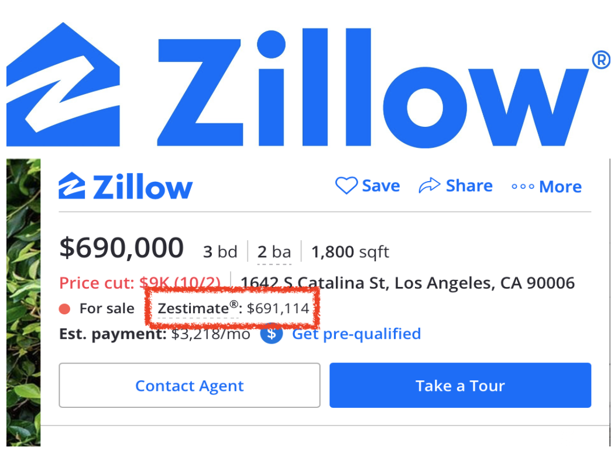

# How do we know what determines property value?

 Zillow, a real estate database company offers what they call 'Zestimate'. According to Zillow, Zestimate is an estimate on property value from their 'public and user submitted data taking into account home facts, location and market conditions'.            
How can we make such predictions? What can we do to improve the predictions? This project explores dataset of features in properties sold in Ames, IA and studies how might we optimize the 'Zestimation' of property value.

Source: https://www.zillow.com
______

### Data Dictionary
This project used the data from the article, Ames Iowa: Alternative to the Boston Housing Data Set. This dataset was used in Ames, IA Assessor’s Office to assess properties sold in Ames, IA from 2006 to 2010. This dataset contains 81 features and 2930 observations.

Source: http://jse.amstat.org/v19n3/decock/DataDocumentation.txt
____________

### Conclusion & Recommendation

> 1. Adding more features does not always improve the prediction result

Why might we not use all of our features for the prediction? If we have more information to learn from, wouldn't that make the prediction perform better? To answer this question first, this approach is too costly most of the time.                
As with most datasets, addition of engineered features and dummying the categorical features, which is a technique to turn categorial features into features that can be evaluated quantitatively were required for this project. **As a result, I ended up with 1003 features.** This means that I would need all these 1003 features to make predictions, which takes a lot of computational resources and meticulous data collecting.                     
Besides the resource issue, using more features does not always improve the prediction. The plot above shows prediction score (R-square) for models that included features with certain threshold of correlation to the target (Correlation here is absolute value). This means at 0, features that had correlation to the target higher than 0 were included, which would mean all available features. The plot shows three types of scores represented in lines. It is shown that the scores have large difference when more features are added to the model. The large difference in the scores implies that the model is too complex and fails to make good predictions on new datasets.

____________

> 2. Coefficient weight from Linear Regression model or feature's correlation to the target cannot be used to decide if the feature is important for prediction.

If we can't use all our features, we have to select important features. First approach I thought of was coefficient weight of each feature to the target in a Linear Regression model and the feature's correlation to the target. Can we use any of these measures? My answer was yes and no. Although we can deduce the importance of the features from the two factors to certain degree, they do not provide perfectly accurate measure.               
The plot above shows this trend. The first plot on the top shows coefficient weight of each features, which is presented in the x-axis with their index. The second plot on the bottom shows the correlation of the feature to the target. It is shown that the magnitude of the two measures does not correspond to each other.(I log-scaled coefficient weight and plotted absolute value of both coefficient weight and correlation show the trend more efficiently.) Accordingly, the feature's correlation to the target and coefficient weight from Linear Regression model are not credible source to judge how useful the features are in predicting our target.

____________

> 3. Use Lasso Regression model to select which features are important for prediction.

How can then we select features for the prediction? Lasso Regression can help with the process. Lasso Regression tells us which features are important by increasing the coefficient weight of important features and decreasing the ones that are not important for the prediction. For my prediction model, I dropped all features that had 0 coefficient weight from the Lasso Regression. **As a result, the number of features to use went down to 49 features.** What this implies is that the rest of 954 features could have been a noise to our prediction.

With Lasso Regression model and the 49 features selected, R-square value, one of my prediction scores was 0.93. This says that 93 percent of how the actual values changes is explained by my model. Another prediction score RMSE, which stands for root mean square error, was 20267$. This suggests that by average the predicted values was 20267$ different from the true values.

____________

### Next Step

What more can we do to improve our model? First, we can use Ridge Regression. This is another regularization model such as Lasso Regression. We can also try log-scaling our target or features to make their distribution more normally distributed. The impact of this can be seen in residual plots such as the one shown above. The more randomly scattered the data points in the plot, the more improvement in our model it implies.   

____________

### Source
1. https://www.zillow.com
2. http://jse.amstat.org/v19n3/decock/DataDocumentation.txt
